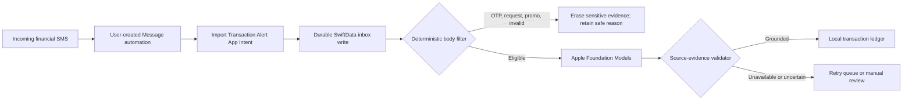

# Pocket Financer — iOS

[](https://github.com/ManishAradwad/pocket-financer-ios/actions/workflows/ci.yml)
[](https://developer.apple.com/ios/)
[](https://www.swift.org/)
[](https://developer.apple.com/xcode/swiftui/)
[](https://developer.apple.com/documentation/foundationmodels)

Pocket Financer is a private, local-first transaction tracker for iPhone. A user-created Shortcuts automation can hand incoming financial alerts to the app, which durably saves them, applies deterministic safety filters, extracts grounded transaction fields with Apple's on-device Foundation Models framework, and stores the resulting ledger with SwiftData.

Financial alerts, prompts, model output, and transactions are not sent to a Pocket Financer server. The app has no analytics SDK, ad SDK, network client, CloudKit transaction sync, or third-party runtime dependency.

> [!IMPORTANT]
> Automatic Message ingestion is an iOS 27 physical-device experiment until the complete Shortcuts payload and locked-device matrix passes on a real iPhone. Manual local import remains available. Historical SMS inbox access is intentionally out of scope because iOS provides no general SMS database API to apps.

## Current vertical slice

- Native iOS 26 app using Swift 6, SwiftUI, SwiftData, App Intents, and Foundation Models.
- `Import Transaction Alert` action for a personal Message automation.
- Inbox-first persistence before filtering or inference, so interruption does not silently lose an eligible alert.
- Sender-independent eligibility: the alert body, not a bank's variable sender format, determines admission.
- Deterministic currency/account/verb checks plus OTP and collect-request rejection.
- Same-sender/body duplicate protection for overlapping `Rs`, `INR`, and `₹` automations; an omitted sender is treated consistently.
- Structured local model extraction with strict source-evidence validation and manual review on uncertainty.
- Runtime locale validation using `supportsLocale(Locale.current)`, with the exact checked locale and model-reported language identifiers visible to the owner.
- Owner-visible V2 processing history: exact request/instructions, post-schema parser draft, per-field validation stages, timing, safe code, disposition, immutable accepted snapshot, and a separate owner-edited ledger.
- A detailed, in-memory synthetic on-device model report, bounded retry, serialized model requests, and honest Apple API limits.
- Dashboard, transactions, editing, manual import, queue diagnostics, privacy details, and confirmed local erasure.
- File protection until first unlock, database backup exclusion, and an app-switcher privacy shield.
- Fail-closed store startup: an unsupported pre-baseline, newer, protected, or otherwise unavailable store is preserved in place while UI and Shortcut imports pause; production never deletes it or substitutes an empty in-memory database.
- Zero third-party package-resolution or runtime dependencies.

## How it works



The model is never trusted as a database writer. Amount, direction, account, merchant, and any parsed date must be grounded in the original alert before a transaction is accepted.

## Processing transparency

Pocket Financer's transparency contract distinguishes five concepts:

1. **Source evidence** is the locally retained alert body and optional sender metadata supplied by Shortcuts.
2. **Parser draft** is the structured response produced by the system model before validation.
3. **Validation** checks every draft field against the source evidence and records a privacy-safe result code when the draft cannot be accepted.
4. **Accepted transaction** contains only evidence-validated values written to the ledger.
5. **Owner correction** is an explicit later edit and must never be presented as the original model response.

The V2 SwiftData schema creates one protected `ExtractionRun` for every live-ingestion or retry model attempt. It durably captures the exact instructions and request used for that attempt, contract/profile identity, timing, the exact app-visible `ParsedAlertDraft` returned after Apple's guided schema mapping, classification/direction/amount/merchant/account/date validation-stage outcomes, a safe result code, terminal disposition, and an immutable accepted-transaction snapshot when validation succeeds. Failed or interrupted attempts remain visible rather than being overwritten by a retry.

That persisted draft is the exact structured value Pocket Financer uses after schema mapping. The current adapter intentionally does not retain `Response.rawContent` or the session transcript, and Apple's API does not expose hidden reasoning. The processing screen separately shows the mutable current ledger transaction. Later owner edits do not rewrite the historical parser draft, validation record, or accepted snapshot.

**Run Synthetic Model Test** opens a detailed report containing the exact synthetic input, instructions, request, checked current locale, result of the locale support check, model-reported language identifiers, returned draft when available, validation result, safe failure, timing, configuration, and API limits. The report remains in memory, creates no transaction, and is released when its sheet is dismissed.

The public iOS 26 Foundation Models interface used by this build does not expose hidden reasoning, a stable owner-readable model build/version, per-request token counts or tokens per second, numeric context-window capacity, KV-cache details, or numeric confidence. It can report that a request exceeded its context window without revealing the window's size. Pocket Financer states those limitations instead of fabricating metrics. Exact prompts and persisted drafts are owner-visible local data only: they must never be copied into logs, telemetry, CI artifacts, source fixtures, screenshots, or issue reports. See [processing transparency](docs/processing-transparency.md) for the audit contract.

## Requirements

- macOS 26 or newer with Xcode 26 or newer.
- iOS 26 or newer for the app.
- A physical Apple Intelligence-capable iPhone for Foundation Models validation; current development targets iPhone 16.
- Apple Intelligence enabled with its on-device assets downloaded, and iPhone and Siri languages aligned to the same supported language.
- An Apple Development team for physical-device signing. A free Personal Team works for development installs.

This project is iPhone-only. The simulator is useful for UI, persistence, and deterministic tests, but a simulator availability result does not prove that Foundation Models assets can generate successfully.

## Local setup

1. Clone the repository and open `PocketFinancer.xcodeproj`.
2. Create `Config/Signing.local.xcconfig` with values unique to your Apple account:

   ```xcconfig
   DEVELOPMENT_TEAM = YOUR_TEAM_ID
   PRODUCT_BUNDLE_IDENTIFIER = your.reverse.dns.pocketfinancer.dev
   ```

   The file is optional and ignored by Git. Signing identities, provisioning profiles, and personal team values must never be committed.

3. Select the `PocketFinancer` scheme and an iPhone simulator or signed physical iPhone.
4. Build and run with Xcode.

The app has no package-resolution step.

If startup shows **Local store unavailable**, do not uninstall the app when its local data matters. Pocket Financer leaves the existing store untouched, pauses imports, displays a privacy-safe category/code, and offers **Retry Local Store**. It never auto-deletes, resets, replaces, or silently falls back to an empty in-memory store in production.

## Verification

Run the repository checks with the Xcode toolchain:

```sh
scripts/format.sh --lint
scripts/build.sh
scripts/test.sh
```

An unsigned Release build can also be run directly:

```sh
xcodebuild \
  -project PocketFinancer.xcodeproj \
  -scheme PocketFinancer \
  -configuration Release \
  -destination 'generic/platform=iOS Simulator' \
  CODE_SIGNING_ALLOWED=NO \
  build
```

CI uses one simulator at a time and disables parallel test destinations to remain predictable on memory-constrained machines. Unit tests use injected parsers and never require Apple Intelligence or real financial alerts.

## Validate Foundation Models

On a freshly installed physical-device build:

1. Open Pocket Financer once and complete onboarding.
2. Open **Settings → Run Synthetic Model Test**.
3. Inspect the in-memory report's synthetic input, exact request, post-schema draft, validation result, safe failure information, timing, and explicit Apple API limits.
4. Record only the privacy-safe result category and latency outside the app. Do not screenshot or attach the detailed report to an issue.
5. Only proceed to live automation validation after the synthetic alert passes or its specific retryable failure is understood.

The app distinguishes model assets that are unavailable, unsupported language/locale, refusal or guardrail behavior, schema/decoding incompatibility, rate limiting, concurrent requests, timeout, and device eligibility. It checks the app's captured `Locale.current` with `supportsLocale` instead of assuming U.S. English. When Apple reports `modelNotReady` or an unsupported locale, the app explains the public category and corrective checks without claiming access to a private cause. Retryable failures remain durable; terminal failures retain evidence for manual review.

## Configure the Message automation

Start with one `Message Contains debited` automation as a proof, then replace it with three sender-free currency automations for `Rs`, `INR`, and `₹`. Multiple Message conditions are combined as AND, not OR, so the three currency markers need separate automations.

The exact iOS 27 editor flow, input-variable mapping, automatic execution setting, and test procedure are documented in [Shortcuts setup](docs/shortcuts-setup.md). The final mapping is:

```text
When I receive a Message where Message Contains Rs
  → Import Transaction Alert
      Message Body = Shortcut Input → Content
      Sender = empty
      Received At = empty
      Source Application = empty
```

Pocket Financer uses the automation execution time when no message timestamp is available. False positives are expected at the trigger boundary and are rejected locally; overlapping currency matches are deduplicated within two minutes.

## Project structure

```text
pocket-financer-ios/
├── Config/                    # Shared, target, version, and ignored local signing settings
├── PocketFinancer/
│   ├── App/                   # App lifecycle, root navigation, privacy shield
│   ├── Data/                  # SwiftData schema, database, file protection
│   ├── Domain/                # Filter, parsers, normalization, evidence validation
│   ├── Features/              # Onboarding, Home, Transactions, Settings
│   ├── Intents/               # Background-safe Shortcuts action
│   ├── Resources/             # Asset catalog and privacy manifest
│   └── Services/              # Ingestion, model adapter, retries, erasure, diagnostics
├── PocketFinancerTests/       # Deterministic unit, recovery, parity, and privacy tests
├── PocketFinancerUITests/     # Onboarding and settings smoke tests
├── docs/                      # Architecture, privacy, device, Shortcuts, and release guides
├── scripts/                   # Local build, format, and test entry points
└── .github/                   # CI, PR title, release, ownership, and dependency automation
```

## Privacy and security model

- Accepted alerts remain local as evidence so the owner can audit an extraction.
- Deterministically rejected OTP, verification, promotional, collect-request, and duplicate bodies are cleared.
- Model-only rejection is not trusted as proof of irrelevance; evidence remains available for owner review.
- The SwiftData store is excluded from backups and protected with `NSFileProtectionCompleteUntilFirstUserAuthentication`, allowing an approved automation to save after the first unlock.
- If the protected store cannot be opened or its schema is unsupported, access and imports pause while the original files remain in place for retry or recovery.
- **Erase All Local Data** removes the ledger, accounts, queue, retained evidence, and persistent extraction-run history. Uninstalling removes the complete app container.
- No real SMS corpus, phone number, account identifier, signing value, prompt transcript, or model response belongs in source control, CI artifacts, logs, screenshots, or issues.

Read [privacy and security](docs/privacy-and-security.md) before changing ingestion, persistence, inference, or diagnostics.

## Relationship to Android

The native Android companion is [`pocket-financer-android`](https://github.com/ManishAradwad/pocket-financer-android). Keep the repositories as sibling checkouts:

```text
Projects/
  pocket-financer-android/
  pocket-financer-ios/
```

The products share reviewed transaction semantics and freshly rewritten synthetic fixtures, not UI code, runtime code, raw SMS exports, or release history. Do not use a submodule or copy Android implementation into this repository.

## Development and releases

All implementation work uses a short-lived `codex/*` branch and a pull request targeting protected `main`. Pull-request titles follow Conventional Commits. Required checks cover formatting, an unsigned Release build, unit tests, UI smoke tests, and dependency/network-policy checks.

Release Please owns version and changelog updates. A merge to `main` may prepare a draft release pull request, but publication remains an explicit maintainer decision. See [CONTRIBUTING.md](CONTRIBUTING.md) and [releasing](docs/releasing.md).

## Roadmap

- [x] Native SwiftUI/SwiftData prototype and local privacy boundary.
- [x] Durable App Intent ingestion and sender-independent deterministic filter.
- [x] Grounded Foundation Models extraction, diagnostics, retry, and synthetic test.
- [x] Owner-visible V2 `ExtractionRun` history with exact request/draft, per-field validation, immutable accepted snapshot, owner-edit separation, and explicit Apple API limits.
- [x] Detailed in-memory synthetic model report with exact synthetic request/draft, validation, safe failure, timing, and API limits.
- [x] Fail-closed local-store startup with safe recovery UI, paused imports, and preservation of unsupported pre-baseline data.
- [x] CI, UI smoke tests, draft release automation, and repository standards.
- [ ] Pass the physical iPhone 16 Foundation Models synthetic test on the current iOS 27 build.
- [ ] Prove `Shortcut Input → Content` and automatic execution while unlocked and locked.
- [ ] Evaluate deterministic candidate extraction plus model-selected candidate IDs against sanitized fixtures.
- [ ] Refine visual identity, App Icon, accessibility, localization, charts, budgets, and insights.
- [ ] Complete App Store privacy, review, TestFlight, and distribution preparation.

## Copyright and usage

Copyright © 2026 Manish Aradwad. All rights reserved.

This repository is **not open source at this time**. No license is granted to use, modify, or redistribute its code or assets. The licensing model may be reconsidered in the future.

## Acknowledgments

- [Apple Foundation Models](https://developer.apple.com/documentation/foundationmodels) for private on-device language-model access.
- [App Intents](https://developer.apple.com/documentation/appintents) and [Shortcuts](https://support.apple.com/guide/shortcuts/welcome/ios) for the user-controlled ingestion boundary.
- [`pocket-financer-android`](https://github.com/ManishAradwad/pocket-financer-android) for the product semantics and cross-platform direction.
