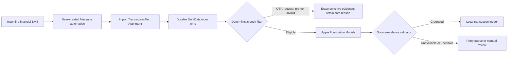

# Pocket Financer — iOS

[](https://github.com/ManishAradwad/pocket-financer-ios/actions/workflows/ci.yml)
[](https://developer.apple.com/ios/)
[](https://www.swift.org/)
[](https://developer.apple.com/xcode/swiftui/)
[](https://developer.apple.com/documentation/foundationmodels)

Pocket Financer is a private, local-first transaction tracker for iPhone. A user-created Shortcuts automation can hand incoming financial alerts to the app, which durably saves them, applies deterministic safety filters, extracts grounded transaction fields with Apple's on-device Foundation Models framework, and stores the resulting ledger with SwiftData.

Financial alerts, prompts, model output, and transactions are not sent to a Pocket Financer server. The app has no analytics SDK, ad SDK, network client, CloudKit transaction sync, or third-party runtime dependency.

> [!IMPORTANT]
> Automatic Message ingestion is an iOS 27 physical-device experiment until the complete Shortcuts payload and locked-device matrix passes on a real iPhone. Manual local import remains available. Historical SMS inbox access is intentionally out of scope because iOS provides no general SMS database API to apps.

## Current vertical slice

Pocket Financer currently implements the complete path from a matching financial SMS to a reviewable local transaction:

1. **Capture the alert:** You create a personal Message automation in Shortcuts and pass the message's `Content` to Pocket Financer's `Import Transaction Alert` action. Pocket Financer cannot browse your Messages inbox or import SMS history by itself.
2. **Save it before doing anything else:** The Shortcut stores the full alert in protected on-device storage and returns immediately; it does not wait for Apple's model. If overlapping `Rs`, `INR`, and `₹` automations deliver the same message within 15 seconds, Pocket Financer keeps one copy.
3. **Process saved alerts when the app is active:** After onboarding, opening or returning to Pocket Financer starts work on its waiting inbox. Local rules first reject clear OTPs and verification codes, collect or mandate requests, failed transactions, and standalone promotions. Their sensitive message bodies are erased. An alert that merely lacks a required transaction clue is kept for review instead of being discarded.
4. **Extract transaction details on device:** Only eligible alerts go to Apple Foundation Models. The model proposes the direction, amount, merchant or counterparty, masked account or card reference, and date. The alert is not sent to a Pocket Financer server.
5. **Check the proposal against the original SMS:** Model output is treated as a suggestion, not trusted data. Pocket Financer checks the transaction wording, requires one unambiguous amount, and verifies the amount, account, and any returned merchant or date text against the source alert. A transaction is written to the ledger only after these checks pass.
6. **Keep uncertain work visible:** Retryable model failures remain queued. After three unsuccessful automatic attempts, an alert moves to Review Required and can still be retried manually. Unsafe or unsupported model output also remains available for review; a model-only rejection never erases the source evidence. A grounded result that is missing only an optional merchant or date can be saved for owner confirmation.
7. **Review and correct the result:** Home shows this month's money in, money out, net cash flow, and recent activity. Transactions separates confirmed items from work that is waiting or needs review. You can inspect the original alert and processing history, correct and confirm a transaction, retry a saved alert, or manually import a synthetic test alert.
8. **See how each attempt was handled:** Protected local history records the rules applied, the request sent to Apple's model, the structured JSON snapshots the app was allowed to observe, the extracted draft, field-by-field validation, timing, and the accepted transaction snapshot. Later edits remain separate from that history. Apple does not expose hidden reasoning, token-level internals, or numeric confidence through this API.
9. **Keep the system local and recoverable:** The app has no analytics, ads, CloudKit transaction sync, Pocket Financer server, or third-party runtime dependency. Its database is excluded from backups, protected by iOS, and covered in the app switcher. If an existing store cannot be opened safely, Pocket Financer pauses access and preserves it for retry rather than deleting it or showing an empty replacement.

## How it works



The model is never trusted as a database writer. Amount, direction, account, merchant, and any parsed date must be grounded in the original alert before a transaction is accepted.

## Processing transparency

Pocket Financer's transparency contract distinguishes seven concepts:

1. **Source evidence** is the locally retained alert body and optional sender metadata supplied by Shortcuts.
2. **Deterministic eligibility** records why the body can or cannot proceed to the model.
3. **Observable generation** is the cumulative structured JSON exposed while Apple generates.
4. **Parser draft** is the mapped structured response produced by the system model before validation.
5. **Validation** checks every draft field against the source evidence and records a privacy-safe result code when the draft cannot be accepted.
6. **Accepted transaction** contains only evidence-validated values written to the ledger.
7. **Owner correction** is an explicit later edit and must never be presented as the original model response.

The V4 SwiftData schema records each deterministic filter evaluation and creates one protected `ExtractionRun` for every live-ingestion or retry model attempt. It durably captures the exact instructions and request used for that attempt, contract/profile identity, timing, cumulative `GeneratedContent.jsonString` snapshots exposed while Apple generates, the exact app-visible `ParsedAlertDraft` returned after guided schema mapping, classification/direction/amount/merchant/account/date validation-stage outcomes, a safe result code, terminal disposition, and an immutable accepted-transaction snapshot when validation succeeds. Failed or interrupted attempts remain visible rather than being overwritten by a retry.

The live-ingestion adapter persists every cumulative raw structured JSON snapshot exposed by Apple's response stream, including the final raw response when it differs from the last streamed snapshot. It does not persist the session transcript, and Apple's iOS 26 API does not expose hidden reasoning, decoded token pieces/IDs, logits, or KV-cache internals. The processing screen shows these snapshots separately from the mapped draft and mutable current ledger transaction. Later owner edits do not rewrite historical generation, validation, or accepted snapshots, and an in-flight retry yields to any owner change made while it was running.

**Run Synthetic Model Test** opens a detailed report containing the exact synthetic input, instructions, request, checked model-processing locale, result of the locale support check, model-reported language identifiers, returned draft when available, validation result, safe failure, timing, configuration, and API limits. The report remains in memory, creates no transaction, and is released when its sheet is dismissed.

The public iOS 26 Foundation Models interface used by this build does not expose hidden reasoning, a stable owner-readable model build/version, per-request token counts or tokens per second, numeric context-window capacity, KV-cache details, or numeric confidence. It can report that a request exceeded its context window without revealing the window's size. Pocket Financer states those limitations instead of fabricating metrics. Exact prompts and persisted drafts are owner-visible local data only: they must never be copied into logs, telemetry, CI artifacts, source fixtures, screenshots, or issue reports. See [processing transparency](docs/processing-transparency.md) for the audit contract.

## Requirements

- macOS 26 or newer with Xcode 26 or newer.
- iOS 26 or newer for the app.
- A physical Apple Intelligence-capable iPhone for Foundation Models validation; current development targets iPhone 16.
- Apple Intelligence enabled with its on-device assets downloaded, and iPhone and Siri languages aligned to the same supported English language. The phone's Region may remain India.
- An Apple Development team for physical-device signing. A free Personal Team works for development installs.

This project is iPhone-only. The simulator is useful for UI, persistence, and deterministic tests, but a simulator availability result does not prove that Foundation Models assets can generate successfully.

## Local setup

1. Clone the repository and open `PocketFinancer.xcodeproj`.
2. Create `Config/Signing.local.xcconfig` with values unique to your Apple account:

   ```xcconfig
   DEVELOPMENT_TEAM = YOUR_TEAM_ID
   PRODUCT_BUNDLE_IDENTIFIER = your.reverse.dns.pocketfinancer.dev
   ```

   The file is optional and ignored by Git. Signing identities, provisioning profiles, and personal team values must never be committed.

3. Select the `PocketFinancer` scheme and an iPhone simulator or signed physical iPhone.
4. Build and run with Xcode.

The app has no package-resolution step.

If startup shows **Local store unavailable**, do not uninstall the app when its local data matters. Pocket Financer leaves the existing store untouched, pauses imports, displays a privacy-safe category/code, and offers **Retry Local Store**. It never auto-deletes, resets, replaces, or silently falls back to an empty in-memory store in production.

## Verification

Run the repository checks with the Xcode toolchain:

```sh
scripts/format.sh --lint
scripts/build.sh
scripts/test.sh
```

An unsigned Release build can also be run directly:

```sh
xcodebuild \
  -project PocketFinancer.xcodeproj \
  -scheme PocketFinancer \
  -configuration Release \
  -destination 'generic/platform=iOS Simulator' \
  CODE_SIGNING_ALLOWED=NO \
  build
```

CI uses one simulator at a time and disables parallel test destinations to remain predictable on memory-constrained machines. Unit tests use injected parsers and never require Apple Intelligence or real financial alerts.

## Validate Foundation Models

On a freshly installed physical-device build:

1. Open Pocket Financer once and complete onboarding.
2. Open **Settings → Run Synthetic Model Test**.
3. Inspect the in-memory report's synthetic input, exact request, post-schema draft, validation result, safe failure information, timing, and explicit Apple API limits.
4. Record only the privacy-safe result category and latency outside the app. Do not screenshot or attach the detailed report to an issue.
5. Only proceed to live automation validation after the synthetic alert passes or its specific retryable failure is understood.

The app distinguishes model assets that are unavailable, unsupported language/locale, refusal or guardrail behavior, schema/decoding incompatibility, rate limiting, concurrent requests, timeout, and device eligibility. Its prompts and requested output are U.S. English, so it checks the explicit `en-US` model-processing locale with `supportsLocale`; the phone's `Locale.current` remains independent for India-region dates, numbers, and currency. This check is only a preflight because `LanguageModelSession` has no locale parameter and can still reject an unsupported input language during generation. Retryable failures remain durable, and any language failure retains evidence for manual review instead of creating a transaction.

## Configure the Message automation

Start with one `Message Contains debited` automation as a proof, then replace it with three sender-free currency automations for `Rs`, `INR`, and `₹`. Multiple Message conditions are combined as AND, not OR, so the three currency markers need separate automations.

The exact iOS 27 editor flow, input-variable mapping, automatic execution setting, and test procedure are documented in [Shortcuts setup](docs/shortcuts-setup.md). The final mapping is:

```text
When I receive a Message where Message Contains Rs
  → Import Transaction Alert
      Message Body = Shortcut Input → Content
      Sender = empty
      Received At = empty
      Source Application = empty
```

Pocket Financer uses the automation execution time when no message timestamp is available. False positives are expected at the trigger boundary and are rejected locally; normalized identical bodies delivered by overlapping currency automations are deduplicated for 15 seconds, independent of optional sender metadata.

## Project structure

```text
pocket-financer-ios/
├── Config/                    # Shared, target, version, and ignored local signing settings
├── PocketFinancer/
│   ├── App/                   # App lifecycle, root navigation, privacy shield
│   ├── Data/                  # SwiftData schema, database, file protection
│   ├── Domain/                # Filter, parsers, normalization, evidence validation
│   ├── Features/              # Onboarding, Home, Transactions, Settings
│   ├── Intents/               # Background-safe Shortcuts action
│   ├── Resources/             # Asset catalog and privacy manifest
│   └── Services/              # Ingestion, model adapter, retries, erasure, diagnostics
├── PocketFinancerTests/       # Deterministic unit, recovery, parity, and privacy tests
├── PocketFinancerUITests/     # Onboarding and settings smoke tests
├── docs/                      # Architecture, privacy, device, Shortcuts, and release guides
├── scripts/                   # Local build, format, and test entry points
└── .github/                   # CI, PR title, release, ownership, and dependency automation
```

## Privacy and security model

- Accepted alerts remain local as evidence so the owner can audit an extraction.
- Deterministically rejected OTP, verification, promotional, collect-request, and duplicate bodies are cleared.
- Model-only rejection is not trusted as proof of irrelevance; evidence remains available for owner review.
- The SwiftData store is excluded from backups and protected with `NSFileProtectionCompleteUntilFirstUserAuthentication`, allowing an approved automation to save after the first unlock.
- If the protected store cannot be opened or its schema is unsupported, access and imports pause while the original files remain in place for retry or recovery.
- **Erase All Local Data** invalidates in-flight processing and removes the ledger, accounts, queue, retained evidence, filter traces, generation snapshots, and extraction-run history. Uninstalling removes the complete app container.
- No real SMS corpus, phone number, account identifier, signing value, prompt transcript, or model response belongs in source control, CI artifacts, logs, screenshots, or issues.

Read [privacy and security](docs/privacy-and-security.md) before changing ingestion, persistence, inference, or diagnostics.

## Relationship to Android

The native Android companion is [`pocket-financer-android`](https://github.com/ManishAradwad/pocket-financer-android). Keep the repositories as sibling checkouts:

```text
Projects/
  pocket-financer-android/
  pocket-financer-ios/
```

The products share reviewed transaction semantics and freshly rewritten synthetic fixtures, not UI code, runtime code, raw SMS exports, or release history. Do not use a submodule or copy Android implementation into this repository.

## Development and releases

All implementation work uses a short-lived `codex/*` branch and a pull request targeting protected `main`. Pull-request titles follow Conventional Commits. Required checks cover formatting, an unsigned Release build, unit tests, UI smoke tests, and dependency/network-policy checks.

Release Please owns version and changelog updates. A merge to `main` may prepare a draft release pull request, but publication remains an explicit maintainer decision. See [CONTRIBUTING.md](CONTRIBUTING.md) and [releasing](docs/releasing.md).

## Roadmap

- [x] Native SwiftUI/SwiftData prototype and local privacy boundary.
- [x] Durable App Intent ingestion and sender-independent deterministic filter.
- [x] Grounded Foundation Models extraction, diagnostics, retry, and synthetic test.
- [x] Owner-visible V4 pipeline history with exact filter decisions, cumulative structured-generation JSON, request/draft, per-field validation, immutable accepted snapshot, owner-edit separation, and explicit Apple API limits.
- [x] Detailed in-memory synthetic model report with exact synthetic request/draft, validation, safe failure, timing, and API limits.
- [x] Fail-closed local-store startup with safe recovery UI, paused imports, and preservation of unsupported pre-baseline data.
- [x] CI, UI smoke tests, draft release automation, and repository standards.
- [ ] Pass the physical iPhone 16 Foundation Models synthetic test on the current iOS 27 build.
- [ ] Prove `Shortcut Input → Content` and automatic execution while unlocked and locked.
- [ ] Evaluate deterministic candidate extraction plus model-selected candidate IDs against sanitized fixtures.
- [ ] Refine visual identity, App Icon, accessibility, localization, charts, budgets, and insights.
- [ ] Complete App Store privacy, review, TestFlight, and distribution preparation.

## Copyright and usage

Copyright © 2026 Manish Aradwad. All rights reserved.

This repository is **not open source at this time**. No license is granted to use, modify, or redistribute its code or assets. The licensing model may be reconsidered in the future.

## Acknowledgments

- [Apple Foundation Models](https://developer.apple.com/documentation/foundationmodels) for private on-device language-model access.
- [App Intents](https://developer.apple.com/documentation/appintents) and [Shortcuts](https://support.apple.com/guide/shortcuts/welcome/ios) for the user-controlled ingestion boundary.
- [`pocket-financer-android`](https://github.com/ManishAradwad/pocket-financer-android) for the product semantics and cross-platform direction.
