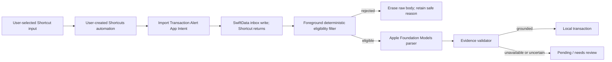

# Architecture

## System boundary

Pocket Financer cannot read the iOS Messages database. A user creates a personal automation in Shortcuts and chooses the app's `Import Transaction Alert` action. The action only stores or deduplicates the alert and returns promptly; after onboarding, the foreground app drains the durable queue through the bounded local pipeline.

Saving precedes classification and inference so App Intent interruption cannot silently lose an alert. Foreground launches drain retryable records serially.

## Layers

- `Data`: versioned SwiftData schema, device-only configuration, and file policy.
- `Domain`: normalized types, deterministic filtering, source identity, amount parsing, and evidence validation.
- `Services`: orchestration, Foundation Models adapter, pending queue, diagnostics, and erasure.
- `Intents`: the smallest background-safe Shortcuts boundary.
- `Features`: native SwiftUI onboarding, home, transactions, and settings.

The Foundation Models parser is behind a protocol. Tests and CI use a deterministic fake and therefore do not require Apple Intelligence.

## Processing transparency boundary

The processing record is deliberately not a single mutable blob called “model output.” Its stages have different trust and retention rules:

1. **Source evidence:** `InboxAlert` durably stores the alert body, optional sender, origin, and timestamps before filter or model work. Deterministic rejection and duplicate handling erase sensitive evidence as described in the privacy policy.
2. **Exact app-visible parser draft:** Foundation Models produces its declared structured profile and the adapter maps it into `ParsedAlertDraft`. V2 persists those exact post-schema fields before validation. The current adapter does not persist `Response.rawContent` or the session transcript, and Apple's API does not expose hidden reasoning.
3. **Validation:** `EvidenceValidator` treats the draft as untrusted and records passed, failed, or not-run outcomes for classification, direction, amount, merchant, account, and date. The attempt also stores its safe result code and disposition.
4. **Accepted saved transaction:** only a grounded validator result can create or update a `Transaction`. The same run stores an immutable snapshot of the accepted amount, currency, direction, merchant, account, date, review state, and retained amount/date evidence.
5. **Owner correction:** a later edit mutates the current ledger entry and sets `isEdited`; it does not rewrite any prior run's parser draft, validation stages, or accepted snapshot. A retry that was already running detects an owner edit or deletion and yields instead of overwriting or recreating the transaction.

Pocket Financer V2 adds `ExtractionRun` to the versioned SwiftData schema and links every run to its source alert. The production parser checks its explicit U.S. English model-processing locale with `supportsLocale` and exposes the identifiers returned by `supportedLanguages`; `Locale.current` remains separate for India-region formatting. A run is inserted and saved with its attempt index, exact instructions/request, contract/profile versions, exact checked model-locale identifier, parser identity, and start time before inference begins. If a structured response arrives, the mapped `ParsedAlertDraft` and response time are saved before validation. Validation stages are then saved before the ledger is mutated. Finally, a safe result code, terminal disposition, completion time, and—when accepted—immutable transaction snapshot are committed. Retries append new runs; they do not rewrite older attempts.

`AlertProcessingDetailView` presents this persistent attempt history as the historical source of truth. Its separately generated current-contract preview is labeled as a preview, and the mutable current ledger section is clearly distinct from each run's immutable accepted snapshot. An incomplete run can therefore expose the last durable boundary after interruption without inventing a terminal result.

The V1-to-V2 migration is lightweight: existing alerts, accounts, and transactions are preserved, while their extraction-run history is empty because no exact historical draft can be reconstructed truthfully. `ExtractionRun` participates in file protection, backup exclusion, **Erase All Local Data**, and uninstall. Its sensitive fields must not be emitted to logs, telemetry, crash reports, notifications, CI artifacts, screenshots, or issue reports.

## Store startup and recovery

`AppDatabase.openShared()` opens the protected production store through the V1-to-V2 migration plan and reapplies file protection. It is a throwing boundary; production has no automatic deletion/reset path and no in-memory fallback. In-memory containers exist only when explicitly requested by tests.

Startup failures are reduced to an owner-safe category and domain/code diagnostic: unrecognized store model, store created by a newer version, protected data unavailable, file-protection failure, or general store-open failure. This includes unsupported pre-baseline prototype stores that cannot be identified as V1. `StoreBootstrapView` does not mount `AppRootView` or a model container after such a failure. It shows a blocking **Local store unavailable** screen, leaves the original store and sidecars in place, warns against uninstalling, and offers an explicit retry.

The App Intent uses the same throwing store boundary and verifies file protection before ingesting. If either step fails, the ingestion service throws `AlertIngestionError.storeUnavailable`, which the intent maps to the owner-safe `ImportTransactionAlertIntentError.localStoreUnavailable` message stating that the alert was not saved and must be run again after recovery. No alert, transaction, extraction run, or replacement store is created. Shortcut imports are therefore paused rather than diverted into temporary memory or silently discarded into a fresh database.

## Synthetic model diagnostic

`ModelSelfTestService` runs one rewritten synthetic alert through the same parser contract and evidence validator without creating a transaction or persistent audit record. Its `ModelSelfTestResult` holds the exact synthetic input, one captured receipt time, instructions, request, exact checked model-processing locale, locale-support result, model-reported language identifiers, parser/configuration details, elapsed time, post-schema `ParsedAlertDraft` when returned, validation outcome and validated fields, safe failure details, and the same explicit Apple API limitations. `ModelSelfTestReportView` owns that result in memory for the lifetime of the Settings sheet; dismissing it releases the report.

The public iOS 26 Foundation Models interface used by this build does not expose hidden reasoning, a stable owner-readable model build/version, per-request token counts or tokens per second, numeric context-window capacity, KV-cache details, or numeric confidence. It does expose `supportedLanguages`, `supportsLocale`, and a categorical context-window-exceeded error. Unavailable numeric values must never be inferred from timing or filled with product-specific guesses.

## Shared Android semantics

The iOS filter mirrors the body-based Android stages: require a currency amount, masked account/card, and completed transaction verb; reject OTP/verification and collect/mandate requests. Sender is optional metadata, never a trigger or eligibility requirement, because real bank and telecom sender formats vary substantially. Sanitized cases live in `PocketFinancerTests/Fixtures/transaction_parity_v1.json` and should be reviewed against the sibling Android repository when either pipeline changes.

Android can use a provider message ID as an authoritative identity. Shortcuts does not currently expose an equivalent stable identifier, so iOS treats the same normalized body delivered within 15 seconds as one delivery, independent of optional sender metadata. That bounded heuristic absorbs overlapping currency automations; an identical alert after the window remains a legitimate transaction.

The repositories remain independent. A monorepo or submodule would couple platform releases and tooling without sharing executable code; sibling checkouts plus parity fixtures give a clearer ownership boundary.
