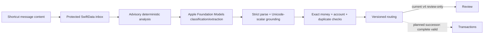

# Architecture

## Authority and system boundary

Pocket Financer cannot read the iOS Messages database. A user-created Shortcuts
automation passes message content to `Import Transaction Alert`, which writes a
protected SwiftData inbox record and returns promptly. Foreground processing then
uses the versioned shared SMS contract owned by the sibling
`pF_slm_selection` repository.

The local SLM is the central semantic classifier and extractor. Deterministic
analysis supplies advisory cues and source spans; it is not an answer allowlist.
The host owns strict parsing, Unicode-scalar grounding, exact money, account
resolution, duplicates, receipt time, persistence, durable operation ownership,
review, and recovery.

Saving precedes inference so App Intent interruption cannot silently lose an
alert. Foreground launches drain retryable records serially.

## Current and planned routing

The native v4 path is implemented in source and is frozen in `review_only` mode.
Every posted v4 result, including a complete valid uniquely resolved result,
remains reviewable until owner confirmation.

The planned additive successor contract will send a complete, strictly valid,
uniquely resolved, non-duplicate posted result directly to Transactions. Only
incomplete, invalid, ambiguous, abstained, interrupted, incompatible, or failed
work will enter Review. A valid `none` decision is a separate non-transaction
outcome. Stored v1-v4 operations keep their original routing.

## Layers

- `Data`: versioned SwiftData schema, protected local configuration, migrations,
  review/feedback state, and file policy.
- `Domain`: shared-contract types, advisory analysis, strict extractor parser,
  Unicode-scalar conversion, exact money, accounts, duplicates, and routing.
- `Services`: orchestration, Foundation Models adapter, operation ownership,
  retries, diagnostics, erasure, and recovery.
- `Intents`: the smallest durable background-safe Shortcuts boundary.
- `Features`: SwiftUI onboarding, Home, Transactions, Review, Settings, and
  owner-visible processing details.

Tests inject model adapters and sanitized vectors; they never require or contain
real financial alerts.

## Review and corrections

Review shows the complete immutable SMS, read-only receipt time, stable reason
codes, advisory analyzer evidence, and the model proposal. Amount, direction,
account, and counterparty have accessible field-specific highlights. Exactly one
native text selection is active at a time.

Confirmation is one atomic local transaction. Owner corrections append
revision-bound local feedback and never rewrite the historical model result or
silently become canonical training labels.

## Processing transparency

Each attempt keeps source evidence, configuration/release identity, advisory
analysis, exact request, observable generation snapshots, strict parser result,
validation, routing, persistence, and later owner correction as distinct facts.
Retries append attempts rather than rewriting history.

Apple Foundation Models exposes cumulative structured-generation snapshots through
the response stream. It does not expose decoded token pieces/IDs, hidden reasoning,
logits, token counts, numeric confidence, KV-cache state, or an app-readable model
artifact. The UI shows observable snapshots while generation is active and labels
token-level information unavailable. It must not reconstruct or fabricate it.

For v4 provenance, iOS uses `system_managed_runtime` and
`model_file_sha256: null`, while recording the observable model identifier,
runtime, OS, device, prompt, grammar, validation, and release. This is the
evidence-backed resolution of the incompatible v3 file-hash requirement.

## Schema and recovery

Consecutive SwiftData migrations preserve existing alerts, accounts, transactions,
operations, reviews, feedback, and observable generation evidence. Missing
historical fields remain absent rather than being invented. Unsupported/newer
stores are preserved and block access; production never deletes them or falls back
to an empty in-memory store.

Erase All Local Data invalidates active claims before deleting pipeline evidence,
transactions, accounts, and inbox content. Suspended work cannot repopulate the
store afterward. Sensitive source, prompts, outputs, spans, and identifiers never
enter logs, telemetry, CI artifacts, screenshots, notifications, or issue reports.

## Operating and verification model

Shared contracts, vectors, and evaluators run from the WSL
`pF_slm_selection` checkout. This repository is built and tested on macOS with
Xcode. The simulator covers UI/storage/migration behavior but does not prove
Foundation Models generation. Physical iPhone validation remains mandatory.

See [SMS processing next steps](sms-processing-next-steps.md),
[processing transparency](processing-transparency.md), and
[device validation](device-validation.md).
